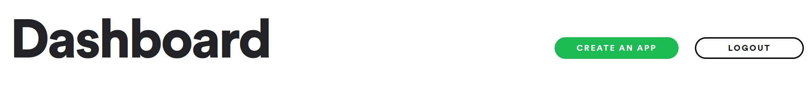
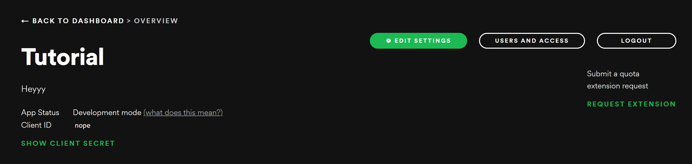

# SVG Spotify widget 🎶


## Set up 👀

* You will need to make a Spotify Application first To do so visit [Spotify Developer portal](https://developer.spotify.com/dashboard/applications)  
* Login and then hit create App



* Fill out the name and the Description and click create.

* Click Edit Settings and add `http://127.0.0.1:5000/spotify` to the redirect URIs  
(P.s don't forget to scroll down and click save)

* Now Copy the Client ID and The Client Secret



* Fork this Repo

* Clone the Github Repo

``` git clone https://github.com/Om-Thorat/Readme-Spotify-Now-Playing.git```

* Now move into the folder

```cd Readme-Spotify-Now-Playing```

* Install the dependencies

```pip install -r requirements.txt```

* Make a tmp directory 

```mkdir tmp```

* Now paste the Credentials you copied into their respective places in your index.py file located at `/api/index.py`

( ⚠️ make sure not to commit this repo with this sensitive info)

* Run the script and a token.json file is created Copy the "refresh_token" from the file.

### Now that we have all our ids secrets and tokens let's create the app 👀

* Create a new vercel app with the repo your forked linked to it.

* Add the following environment variables while creating the app 
> don't worry if you forget you can always edit them in settings > Environment variables

* CLIENT_ID = client id copied from spotify dashboard  
* CLIENT_SECRET = client secret copied from spotify dashboard
* REFRESH = refresh token copied from json file

Click save and **voila!** you have your own svg spotify widget 🎉

Visit ```{yoururl}.vercel.app/spotify``` to see 👀

To use it in your readme's just link to your hosting url /spotify  
for example:
``````

Thanks,
💖 Happy Coding.
